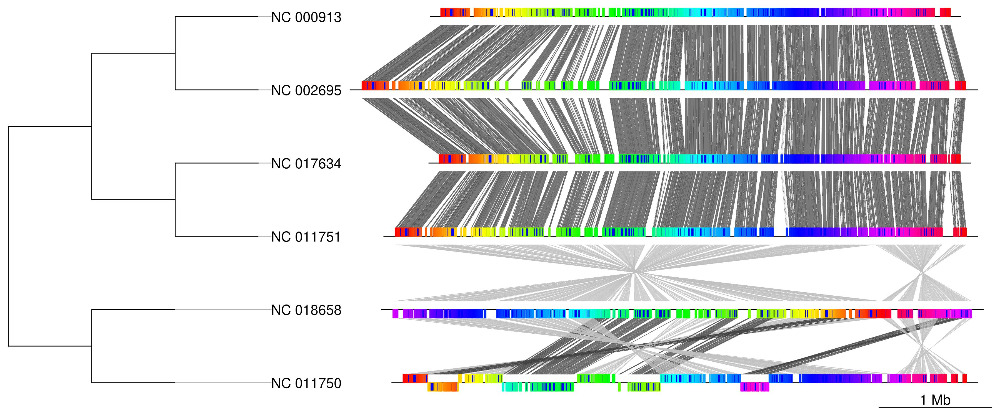
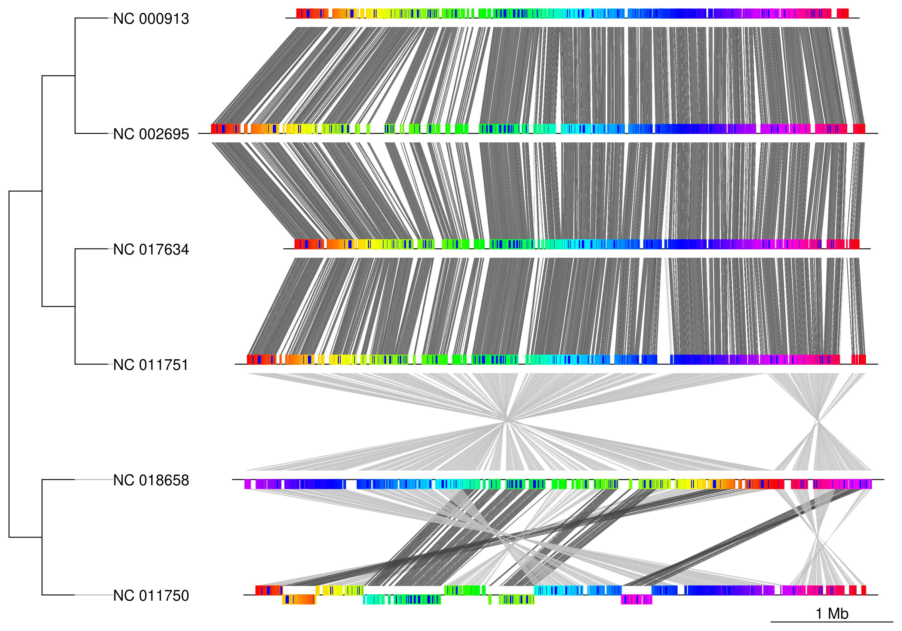
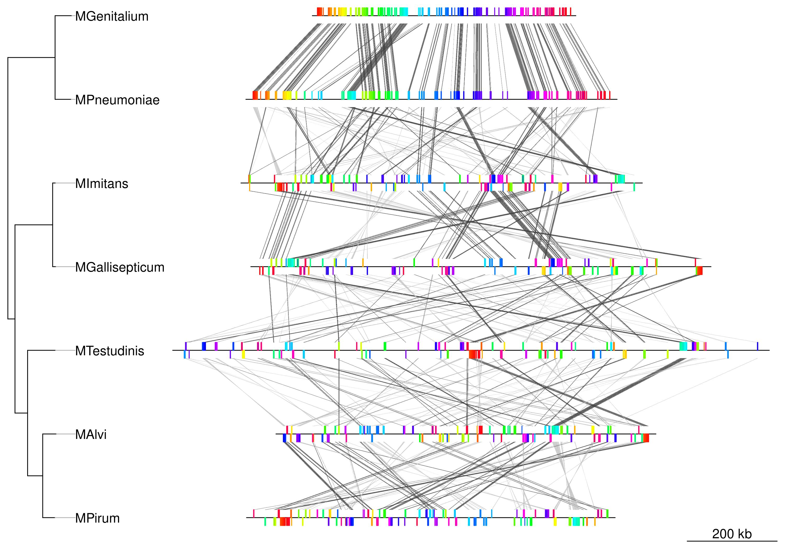

# Plot genome alignment figure tool

Automated genome alignment figure plot tool using progressiveMauve & genoPlotR.  

Genome alignment figure is output from input genome sequence files(Genbank|Fasta format).  

  
Fig. 6 *E.coli* genome alignment visualization result

## Requirements

This tool is implemented in Python3 & R (Tested on Ubuntu20.04).  

Following dependencies are required.

- `BioPython` (Python library)
- `genoPlotR`, `ape`, `ade4` (R library)
- `progressiveMauve` (External dependencies)

## Command Usage

### Basic Command

    python plot_genome_align_fig.py -i [genome_files_dir] -t [genome_tree_file] -o [outdir] 

### Options

    -h, --help      show this help message and exit
    -i , --indir    Input genome Genbank or Fasta files directory (*.gbk|*.fa)
    -o , --outdir   Output directory
    -t , --tree     Newick species tree file
    --width         Plot width inch (Default: 10)
    --height        Plot height inch (Default: 7)
    --tree_width    Plot tree width inch (Default: 2)

>:warning: *Input file name* and *input newick tree leaf name* must be match.

### Example Command

#### Example of 6 *E.coli* species genome (Genbank)

    python plot_genome_align_fig.py -i example/ecoli/genbank -t example/ecoli/ecoli.nwk -o ecoli_plot1

  

#### Example of 6 *E.coli* species genome (Fasta)

Change `width`, `height`, `tree_width` parameters.  

    python plot_genome_align_fig.py -i example/ecoli/fasta -t example/ecoli/ecoli.nwk -o ecoli_plot2 --width 12 --height 5 --tree_width 4

  

#### Example of 7 *Mycoplasma* species genome

    python plot_genome_align_fig.py -i example/mycoplasma/genbank -t example/mycoplasma/mycoplasma.nwk -o mycoplasma_plot

  
